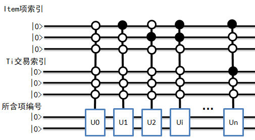
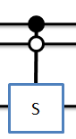
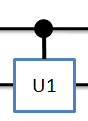
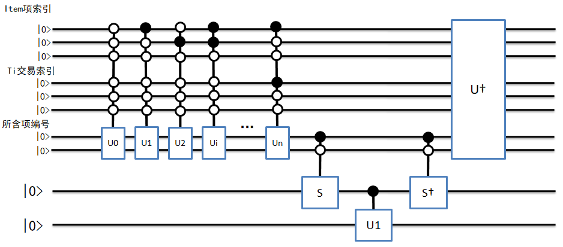
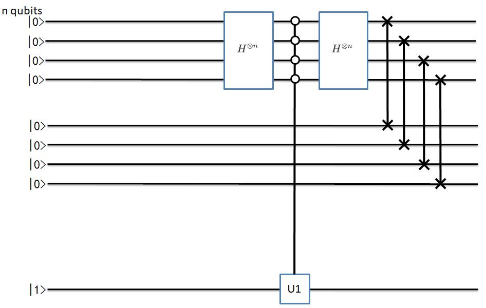
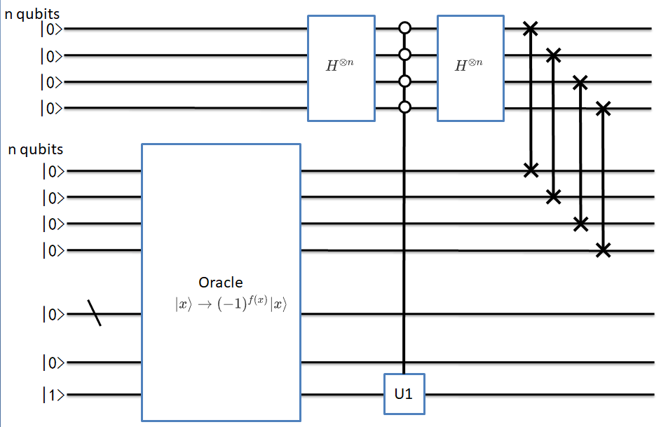
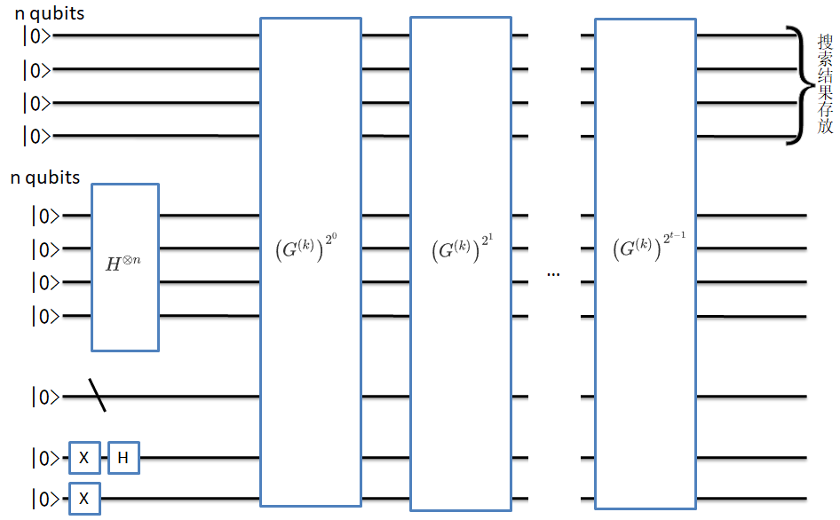

QARM说明文档
==========================
**version：3.1**

**Author：李蕾**

**Update Date：20200509**

1.关联规则挖掘（Association Rules Mining）简介
------------------------------------------------

1.1关联规则
++++++++++++++++++++++++

在网上购物时，系统会主动推荐一些商品，赠送一些优惠券，并且这些推荐的商品和赠送的优惠券往往都能直抵我们的需求，诱导我们消费。这背后主要使用使用了关联分析技术，通过分析哪些商品经常一起购买，可以帮助商家了解用户的购买行为。从大规模数据中挖掘对象之间的隐含关系被称为关联分析（associate analysis）或者关联规则学习（associate rule learning），其可以揭示数据中隐藏的关联模式，帮助人们进行市场运作，决策支持等。

1.2关联规则的相关概念
+++++++++++++++++++++++++++++

:math:`I=\left\{i_{1}, i_{2}, \ldots, i_{n}\right\}` 被称为项集（items），其中:math:`i_j∈\{0,1\}` 被称为项。

:math:`D=\left\{t_{1}, t_{2}, \ldots, t_{m}\right\}` 被称为数据库（database）其中:math:`t_{k}` 被称为事务（transaction）。

事务是项的集合，即事务是:math:`I` 的一个子集，:math:`t_{k} \subseteq I` ，每个事务用一个唯一的transaction ID进行标识。规则（rule）定义如下：

:math:`X \Rightarrow Y` ，其中 :math:`X, Y \subseteq I`    

为了从所有可能的规则集中选出有趣的规则（interesting rules），需要用到各种重要度（significance）、兴趣度（interest）约束，其中最有名的是支持度（support）和置信度（confidence）。

1.支持度support：数据集中包含该项集的数据所占数据集的比例，度量一个集合在原始数据中出现的频率

2.置信度confidence：是针对一条关联规则来定义的，a->b的置信度=支持度{a|b}/支持度{a}，a|b表示ab的并集

1.3 关联分析目标
++++++++++++++++++

1. 发现频繁项集（频繁项集是满足最小支持度要求的项集，它给出经常在一起出现的元素项）
2. 发现关联规则（关联规则意味着元素项之间“如果…那么…”的关系）

**Apriori原理，**

1. 如果某个项集是频繁的，那么它的所有子集也是频繁的
2. 如果某个项集是非频繁的，那么它的所有超集也是非频繁的
3. 基于此，Apriori算法从单元素项集开始，通过组合满足最小支持度的项集来形成更大的集合

2. QARM解决的问题
--------------------

基于著名的经典关联规则挖掘算法Apriori算法，提出一个实现该核心任务的量子关联规则挖掘算法。具体来说，在给定访问交易数据库的量子黑盒的条件下，该算法首先利用量子并行幅度估计算法以量子并行方式估计所有候选k项集的支持度，并将其存储于一个量子叠加态中。接下来，使用量子幅度放大算法，从该叠加量子态中搜索出那些不小于预定阈值的候选k项集，即频繁k项集。

3. 实现步骤
---------------

对于交易数据库，含有N个交易的交易集，记为:math:`\mathscr{T}=\left\{T_{0}, T_{1}, \cdots, T_{N-1}\right\}` ，每项交易是:math:`M` 个项集:math:`\mathscr{I}=\left\{I_{0}, I_{1}, \cdots, I_{M-1}\right\}` 的子集来构成，每个交易包含于:math:`M` 项集，即:math:`T_{i} \subseteq \mathscr{I}` 。因此交易数据库可以表示为一个:math:`N \times M` 的编码矩阵，记为:math:`D` ，其中元素:math:`D_{i j}\not=0` 表示交易:math:`T_{i}` 中包含:math:`I_{j}` 项，否则元素:math:`D_{i j}=0` 。

示例如下：

==============      ======================
交易                 项（商品）       
==============      ======================
:math:`T_{0}`        面包、奶酪、牛奶 
:math:`T_{1}`        面包、黄油       
:math:`T_{2}`        奶酪、牛奶       
:math:`T_{3}`        面包、奶酪       
:math:`T_{4}`        奶酪、黄油、牛奶 
==============      ======================

可以用如下矩阵表示

:math:`\left(\begin{array}{llll}1 & 2 & 3 & 0 \\ 0 & 0 & 3 & 4 \\ 1 & 2 & 0 & 0 \\ 1 & 0 & 3 & 0 \\ 1 & 2 & 0 & 4\end{array}\right)` 

其中{1: '奶酪', 2: '牛奶', 3: '面包', 4: '黄油'}，0表示没有此项

3.1 使用经典算法得到候选1项集
+++++++++++++++++++++++++++++++

代码如下：

::

 # 获取候选1项集，data_set为转化后的数字交易信息，不包含0数字。返回一个list，每个元素都是tuple元组
    def create_c1(self, data_set):
        c1 = []  # 元素个数为1的项集（非频繁项集，因为还没有同最小支持度比较）
        for transaction in data_set:
            for item in transaction:
                if not [item] in c1 and item != 0:
                    c1.append([item])
        return list(map(tuple, c1))

3.2 根据具体数据进行二进制线路的编码
++++++++++++++++++++++++++++++++++++++++

该编码是为了方便其他函数的使用，其代码如下：

::

 # 根据当前number绘制子线路
 def get_number_circuit(self, qlist, position, number, qubit_number):
     cir = pq.QCircuit()
     # 把当前item的数字变成二进制数字符串，并去除前面的0b字符
     bin_str = bin(number).replace('0b', '')
     # 对于不足量子比特数的前面用0进行补齐，并逆排序
     bin_str = list((qubit_number - len(bin_str)) * '0' + bin_str)[::-1]
     for j, bit in enumerate(bin_str):
         if bit == '1':
             cir.insert(X(qlist[position + j]))
             # print('画子线路')
             # pq.draw_qprog(cir)
             return cir

 

3.3 构建量子黑盒线路，实现数据的编码
+++++++++++++++++++++++++++++++++++++++

对交易数据库，进行二维编码，每一行是一条交易信息，每一列表示所含的项，使用行列两个索引来表示交易数据。对每一个项进行独立数字表示，形如本节一开始介绍，称此线路为U 线路。

其线路编码结构如下：

其代码如下：

::

 # Oracle中的 U 线路编码
 def encode_circuit(self, qlist, position, index_qubit_number, items_length,  transaction_number):
     cir = pq.QCircuit()
 
     # 控制子线路的量子比特，对应索引空间的比特数
     control_qubit = []
     for i in range(index_qubit_number):
         control_qubit.append(qlist[position + i])
 
         # 编码信息的位置
         information_position = position + index_qubit_number
         for n in range(transaction_number):
             # 对交易行索引量子线路进行 X 门编码
             t_x_cir = self.get_number_circuit(qlist, position+self.items_qubit_number,
                                               2 ** self.transaction_qubit_number - 1 - n,  self.transaction_qubit_number)
             for m in range(items_length):
                 # 对项列索引量子线路进行 X 门编码
                 item_x_cir = self.get_number_circuit(qlist, position, 2 ** self. items_qubit_number - 1 - m,
                                                      self.items_qubit_number)
                 cir.insert(item_x_cir)
                 cir.insert(t_x_cir)
                 # 对此行此列数字进行编码
                 sub_cir = self.get_number_circuit(qlist, information_position, self. transaction_matrix[n][m],
                                                   self.digit_qubit_number)
                 cir.insert(sub_cir.control(control_qubit))
                 cir.insert(t_x_cir)
                 cir.insert(item_x_cir)
 
                 # print('U线路：')
                 # pq.draw_qprog(cir)
                 return cir

3.4 数据查询线路
++++++++++++++++++++++

根据查询的数据进行线路编码，得到将要查询数据的索引，称此线路为S线路，其线路结构如下：

其代码如下：

::

 # 定义Oracle中的查找线路 S
 def query_circuit(self, qlist, position, target_number):
     cir = pq.QCircuit()
     sub_cir = self.get_number_circuit(qlist, position, 2 ** self.digit_qubit_number -  target_number - 1,
                                       self.digit_qubit_number)
     cir.insert(sub_cir)
     control_qubit = []
     for i in range(self.digit_qubit_number):
         control_qubit.append(qlist[position + i])
     cir.insert(X(qlist[position + self.digit_qubit_number]).control(control_qubit))
     cir.insert(sub_cir)
     # print('S线路：')
     # pq.draw_qprog(cir)
     return cir

3.5 相位转移线路
+++++++++++++++++++++++++

根据查询的结果，把相位进行转移，称此线路为Transfer，其结构如下：

其代码实现如下：

::

 # 定义Oracle中的相位转移线路
 def transfer_to_phase(self, qlist, position):
     cir = pq.QCircuit()
     cir.insert(U1(qlist[position+1], math.pi).control([qlist[position]]))
     print('相位转移线路：')
     pq.draw_qprog(cir)
     return cir

3.6 Oracle线路
++++++++++++++++++++

oracle线路实现相位取反操作，整体结构由U+S+Transfer+S.dagger+U.dagger()线路构成

其结构如下：

其代码实现如下：

::

 # 定义oracle线路
 def oracle_cir(self, qlist, position, locating_number):
     # U线路
     u_cir = self.encode_circuit(qlist, position, self.index_qubit_number,
                                 self.items_length, self.transaction_number)
     # S线路
     s_cir = self.query_circuit(qlist, position + self.index_qubit_number, locating_number)
     # 相位转移线路
     transfer_cir = self.transfer_to_phase(qlist, position + self.index_qubit_number + self. digit_qubit_number)
 
     cir = pq.QCircuit()
     cir.insert(u_cir)
     cir.insert(s_cir)
     cir.insert(transfer_cir)
     cir.insert(s_cir.dagger())
     cir.insert(u_cir.dagger())
     # print('oracle线路：')
     # pq.draw_qprog(cir)
     return cir

3.7 coin线路
++++++++++++++++++

coin线路实现搜索结果的索引转移和提高结果的概率，其结构如下：

实现代码如下：

::

 # 定义coin线路
 def coin_cir(self, qlist, position):
     u1_position = position + 1 + 2*self.index_qubit_number + self.digit_qubit_number
     swap_interval = self.index_qubit_number
     coin_position = position
     cir = pq.QCircuit()
     control_qubit = []
     for i in range(self.index_qubit_number):
         cir.insert(H(qlist[coin_position + i]))
         # 变成0控
         cir.insert(X(qlist[coin_position + i]))
         # 控制比特
         control_qubit.append(qlist[coin_position + i])
     control_cir = pq.QCircuit()
     # 控制线路
     control_cir.insert(U1(qlist[u1_position], math.pi))
     cir.insert(control_cir.control(control_qubit))
     for i in range(self.index_qubit_number):
         # 控制线路还原
         cir.insert(X(qlist[coin_position + i]))
         cir.insert(H(qlist[coin_position + i]))
         cir.insert(SWAP(qlist[coin_position + i],
                         qlist[coin_position + i + swap_interval]))
     # print('coin 线路：')
     # pq.draw_qprog(cir)
     return cir

3.8 G(k)线路
+++++++++++++++++++++

G(k)线路结构如下：

实现代码如下：

::

 # 定义G（k）线路
 def gk_cir(self, qlist, position, locating_number):
     cir = pq.QCircuit()
     oracle_cir = self.oracle_cir(qlist, position+self.index_qubit_number, locating_number)
     coin_cir = self.coin_cir(qlist, position)
     cir.insert(oracle_cir)
     cir.insert(coin_cir)
     # print('G(k)线路：')
     # pq.draw_qprog(cir)
     return cir

3.9 循环迭代
+++++++++++++++++++++

通过一定次数的循环迭代，可在coin线路的索引上得到索引数据的概率分布，其中概率最大的，即是所查询的数据的结果索引，其线路结构如下：

其代码实现如下：

::

 # 定义循环迭代线路
 def iter_cir(self, qlist, clist, position, locating_number, iter_number):
     prog = pq.QProg()
     for i in range(self.index_qubit_number):
         prog.insert(H(qlist[position + self.index_qubit_number + i]))
     prog.insert(X(qlist[position + 2*self.index_qubit_number + self.digit_qubit_number]))
     prog.insert(H(qlist[position + 2*self.index_qubit_number + self.digit_qubit_number]))
     prog.insert(X(qlist[position + 2*self.index_qubit_number + self.digit_qubit_number + 1]))
 
     cir = self.gk_cir(qlist, position, locating_number)
     for n in range(iter_number):
         prog.insert(cir)
     # print('总线路：')
     # pq.draw_qprog(prog)
     result_qubit = []
     for i in range(self.index_qubit_number):
         result_qubit.append(qlist[i])
     result = prob_run_dict(prog, result_qubit)
     # print('测量结果字典：')
     # print(result)
     return result

循环迭代的次数，根据论文中公式计算，发现当迭代次数为偶数次时，无法得到想要的结果，需要进行奇数化处理。

另外，当查询的总数较多时，根据公式计算的迭代次数过大，会错过得到结果时的次数，根据本人多次实验发现，当查找结果就1个数时，迭代次数根据公式计算后并进行奇数化，能够很大概率得到结果，但当查找结果超过1个时，该迭代次数就会错过结果。而迭代次数为5次时，基本都能得到结果，所以，当迭代次数不小于9次时，采用固定5次迭代来查询结果。

其代码如下：

::

 # 迭代次数计算
 def iter_number(self):
     estimate_count = math.floor(math.pi * math.sqrt(2 ** self.index_qubit_number) / 2)
     if estimate_count % 2:
         count = estimate_count
     else:
         count = estimate_count + 1
     if count >= 9:
         count -= 4
     return count

3.10 对查询结果的索引进行处理
++++++++++++++++++++++++++++++++

根据线路查询的结果，得出结果索引，然后对结果索引进行处理，分离出行索引、列索引，将行、列索引作为一对数字，用元组存储到结果中。

其代码如下：

::

 # 结果处理
 def get_result(self, qlist, clist, position, locating_number, iter_number):
     result = self.iter_cir(qlist, clist, position, locating_number, iter_number)
     val_list = []
     for val in result.values():
         val_list.append(round(val, 4))
     np_val_list = np.array(val_list)
     # print('测量结果概率：')
     # print(np_val_list)
     max_val = np.max(np_val_list)
     # print('查找结果概率：', max_val)
     index = np.argwhere(np_val_list == max_val)
     index = index.flatten().tolist()
     # print('查找结果总索引：', index)
     result = self.get_index(index)
     # print('-' * 50)
     # print('行列索引结果：', result)
     # print('-' * 50)
     return result
 
 # 处理总查询结果索引
 def get_index(self, index):
     result = []
     for idx in index:
         bin_str = bin(idx).replace('0b', '')
         bin_str = (self.index_qubit_number - len(bin_str)) * '0' + bin_str
         transaction_index = int(bin_str[:self.transaction_qubit_number], 2)
         item_index = int(bin_str[self.transaction_qubit_number:], 2)
         result.append((transaction_index, item_index))
     return result

3.11 找出频繁1项集
+++++++++++++++++++++++

根据线路查询的结果，计算其支持度，并与最小支持度进行比较，得到是否满足最小支持度要求，如果满足，即可判断其是频繁项集。依次去判断每个候选项集是否为频繁项集。

将结果的频繁1项集用元组保存，所有结果存入一个列表中

将结果的频繁1项集对应的索引，和支持度存入字典中，键为频繁1项集元组，值为列表，列表第一项为索引列表，第二项为支持度。

其代码如下：

::

 # 根据候选1项集找频繁1项集， 候选项是列表套元组形式 [(1,), (2,), (3,), (4,)]
 def find_f1(self, qlist, clist, position, c1, min_support=0.4):
     iter_number = self.iter_number()
     # 根据量子线路，去得到每个候选1项集的行列索引
     ck_dict = {}
     for data in c1:
         locating_number = data[0]
         result = self.get_result(qlist, clist, position, locating_number, iter_number)
         row_index = [index[0] for index in result]
         ck_dict[data] = row_index
     # 计算每个候选1项集的支持度
     f1_dict = {}
     f1 = []
     for key, val in ck_dict.items():
         support = len(val) / self.transaction_number
         if support >= min_support:
             f1_dict[key] = [val, support]
             f1.append(key)
     return f1, f1_dict

3.12 根据频繁k项集得到频繁k+1项集
+++++++++++++++++++++++++++++++++++

依据得到的频繁k项集，去得到频繁k+1项集，存储结构与频繁1项集一样

::

 # 根据频繁k项集，去查找后面的频繁k+1项集
 # f1_dict = {(1,): [[0, 2, 3, 4], 0.8], (2,): [[0, 2, 4], 0.6], (3,): [[0, 1, 3], 0.6]}
 # f1 = [(1,), (2,), (3,)]
 def find_fk(self, k, fk, fk_dict, min_support=0.4):
     cn = []
     fn_dict = {}
     fn = []
     len_fk = len(fk)
     for i in range(len_fk):
         for j in range(i + 1, len_fk):
             # 前k-1项相同时，才将两个集合合并，合并后才能生成k+1项
             L1 = list(fk[i])[:k - 2]
             L2 = list(fk[j])[:k - 2]
             L1.sort()
             L2.sort()
             if L1 == L2:
                 # 候选项
                 c = tuple(frozenset(fk[i]) | frozenset(fk[j]))
                 cn.append(c)
                 # 频繁项索引
                 set1_index = frozenset(fk_dict[fk[i]][0])
                 set2_index = frozenset(fk_dict[fk[j]][0])
                 # 频繁项索引交集
                 set_index = set1_index & set2_index
                 index_list = list(set_index)
                 support = len(index_list) / self.transaction_number
                 if support >= min_support:
                     fn_dict[c] = [index_list, support]
                     fn.append(c)
     return fn, fn_dict

3.13 统计所有频繁项集
+++++++++++++++++++++++++

根据得到的频繁1项集，和依据频繁k项集去得到频繁k+1项集，即可得到所有的频繁项集，存储结构同上

代码如下：

::

 # 频繁项集统计
 def fk_result(self, qlist, clist, position, min_support=0.5):
     # 准备候选1项集
     c1 = self.create_c1(self.transaction_matrix)
     # 获得频繁1项集，频繁1项集对应交易索引和支持度
     f1, f1_dict = self.find_f1(qlist, clist, position, c1, min_support)
 
     # 定义一个列表，用于存储频繁项集
     fn = []
     # 定义一个列表，用于存储频繁项集和索引以及支持度
     fn_dict = {}
     # 根据频繁1项集，去获得后面的频繁n项集
     k = 2
     fk = f1
     fk_dict = f1_dict
     while fk:
         fn.append(fk)
         fn_dict.update(fk_dict)
         fk_result = self.find_fk(k, fk, fk_dict, min_support)
         fk = fk_result[0]
         fk_dict = fk_result[1]
         k += 1
     return fn, fn_dict

3.14 置信度计算
+++++++++++++++++++++

根据所有的频繁项集，去计算满足最小置信度要求的置信因果关系，结果以字典形式存储

其代码如下：

::

 # 置信度计算
 def conf_x_y(self, supp_xy, supp_x):
     return supp_xy/supp_x
 
 # 统计置信度
 def get_all_conf(self, qlist, clist, position, min_conf=0.6):
     fn, fn_dict = self.fk_result(qlist, clist, position, min_support=0.4)
     len_fn = len(fn)
     if len_fn < 2:
         return None
     conf_dict = {}
     for i in range(1, len_fn):
         for backward in fn[i]:
             # 后项集合
             set_backward = frozenset(backward)
             for forward in fn[i-1]:
                 # 前项集合
                 set_forward = frozenset(forward)
                 # 判断前项是否为后项的子集
                 if set_forward.issubset(set_backward):
                     # 取出支持度
                     supp_xy = fn_dict[backward][1]
                     supp_x = fn_dict[forward][1]
                     # 计算可信度
                     conf = self.conf_x_y(supp_xy, supp_x)
                     # 比较可信度
                     if conf >= min_conf:
                         cause = set_forward
                         effect = set_backward - set_forward
                         key = self.get_conf_key(cause, effect)
                         conf_dict[key] = conf
     return conf_dict
 
 # 根据数字转换为字符串，作为置信度的键
 def get_conf_key(self, cause, effect):
     cause_list = list(cause)
     effect_list = list(effect)
     cause_str = ','.join([self.items_dict[i] for i in cause_list])
     effect_str = ','.join([self.items_dict[i] for i in effect_list])
     key = cause_str + '->' + effect_str
     return key

4.所有代码和测试结果
--------------------------

代码如下：

::

 """
 量子关联规则挖掘算法，针对频繁项集进行构建
 """
 from pyqpanda import *
 import pyqpanda.pyQPanda as pq
 import numpy as np
 import math
 from itertools import chain
 
 
 class InitQMachine:
     def __init__(self, quBitCnt, cBitCnt, machineType=pq.QMachineType.CPU):
         self.m_machine = pq.init_quantum_machine(machineType)
         self.m_qlist = self.m_machine.qAlloc_many(quBitCnt)
         self.m_clist = self.m_machine.cAlloc_many(cBitCnt)
         self.m_prog = pq.QProg()
 
     def __del__(self):
         pq.destroy_quantum_machine((self.m_machine))
 
 
 class QuantumAssociationRulesMining:
     def __init__(self, transaction_data):
         self.transaction_data = transaction_data
         # 交易信息统计
         self.information = self.get_information(self.transaction_data)
         # 交易信息条数
         self.transaction_number = self.information[0]
         # 交易所含总项数
         self.items_length = self.information[1]
         # 交易所含项
         self.items = self.information[2]
         # 交易对应编码字典
         self.items_dict = self.information[3]
         # 交易矩阵
         self.transaction_matrix = self.information[4]
         # 交易所含项索引的量子比特数
         self.items_qubit_number = self.get_qubit_number(self.items_length - 1)
         # 交易条数索引的量子比特数
         self.transaction_qubit_number = self.get_qubit_number(self.transaction_number - 1)
         # 索引空间的量子比特数
         self.index_qubit_number = self.items_qubit_number + self.transaction_qubit_number
         # 数据的量子比特数
         self.digit_qubit_number = self.get_qubit_number(max(self.items))
 
     # 定义获取交易数据数量，交易的项，交易的项数量
     def get_information(self, transaction_data):
         # 交易条数
         transaction_number = len(transaction_data)
         # 交易所含项，集合
         items_set = set(chain.from_iterable(transaction_data))
         # 转为列表
         items = list(items_set)
         items.sort()
         # 交易所含项数
         items_length = len(items)
         # 用数字与所含项进行对应形成字典
         items_dict = {i+1: items[i] for i in range(items_length)}
         # items数字化
         items = tuple([i+1 for i in range(items_length)])
         # 将交易信息转化为二维矩阵
         transaction_matrix = []
         for data in transaction_data:
             temp = list(items)
             for i, key in enumerate(temp):
                 if items_dict[key] not in data:
                     temp[i] = 0
             transaction_matrix.append(temp)
 
         return transaction_number, items_length, items, items_dict, transaction_matrix
 
     # 根据项数或者交易数获取量子比特数量
     def get_qubit_number(self, number):
         return math.floor(math.log(number, 2) + 1)
 
     # 获取候选1项集，data_set为转化后的数字交易信息，不包含0数字。返回一个list，每个元素都是tuple元 组
     def create_c1(self, data_set):
         c1 = []  # 元素个数为1的项集（非频繁项集，因为还没有同最小支持度比较）
         for transaction in data_set:
             for item in transaction:
                 if not [item] in c1 and item != 0:
                     c1.append([item])
         return list(map(tuple, c1))
 
     # 根据当前number绘制子线路
     def get_number_circuit(self, qlist, position, number, qubit_number):
         cir = pq.QCircuit()
         # 把当前item的数字变成二进制数字符串，并去除前面的0b字符
         bin_str = bin(number).replace('0b', '')
         # 对于不足量子比特数的前面用0进行补齐，并逆排序
         bin_str = list((qubit_number - len(bin_str)) * '0' + bin_str)[::-1]
         for j, bit in enumerate(bin_str):
             if bit == '1':
                 cir.insert(X(qlist[position + j]))
         # print('画子线路')
         # pq.draw_qprog(cir)
         return cir
 
     # Oracle中的 U 线路编码
     def encode_circuit(self, qlist, position, index_qubit_number, items_length,  transaction_number):
         cir = pq.QCircuit()
 
         # 控制子线路的量子比特，对应索引空间的比特数
         control_qubit = []
         for i in range(index_qubit_number):
             control_qubit.append(qlist[position + i])
 
         # 编码信息的位置
         information_position = position + index_qubit_number
         for n in range(transaction_number):
             # 对交易行索引量子线路进行 X 门编码
             t_x_cir = self.get_number_circuit(qlist, position+self.items_qubit_number,
                                               2 ** self.transaction_qubit_number - 1 - n,  self.transaction_qubit_number)
             for m in range(items_length):
                 # 对项列索引量子线路进行 X 门编码
                 item_x_cir = self.get_number_circuit(qlist, position, 2 ** self. items_qubit_number - 1 - m,
                                                      self.items_qubit_number)
                 cir.insert(item_x_cir)
                 cir.insert(t_x_cir)
                 # 对此行此列数字进行编码
                 sub_cir = self.get_number_circuit(qlist, information_position, self. transaction_matrix[n][m],
                                                   self.digit_qubit_number)
                 cir.insert(sub_cir.control(control_qubit))
                 cir.insert(t_x_cir)
                 cir.insert(item_x_cir)
 
         # print('U线路：')
         # pq.draw_qprog(cir)
         return cir
 
     # 定义Oracle中的查找线路 S
     def query_circuit(self, qlist, position, target_number):
         cir = pq.QCircuit()
         sub_cir = self.get_number_circuit(qlist, position, 2 ** self.digit_qubit_number -  target_number - 1,
                                           self.digit_qubit_number)
         cir.insert(sub_cir)
         control_qubit = []
         for i in range(self.digit_qubit_number):
             control_qubit.append(qlist[position + i])
         cir.insert(X(qlist[position + self.digit_qubit_number]).control(control_qubit))
         cir.insert(sub_cir)
         # print('S线路：')
         # pq.draw_qprog(cir)
         return cir
 
     # 定义Oracle中的相位转移线路
     def transfer_to_phase(self, qlist, position):
         cir = pq.QCircuit()
         cir.insert(U1(qlist[position + 1], math.pi).control([qlist[position]]))
         # print('相位转移线路：')
         # pq.draw_qprog(cir)
         return cir
 
     # 定义oracle线路
     def oracle_cir(self, qlist, position, locating_number):
         # U线路
         u_cir = self.encode_circuit(qlist, position, self.index_qubit_number,
                                     self.items_length, self.transaction_number)
         # S线路
         s_cir = self.query_circuit(qlist, position + self.index_qubit_number,  locating_number)
         # 相位转移线路
         transfer_cir = self.transfer_to_phase(qlist, position + self.index_qubit_number +  self.digit_qubit_number)
 
         cir = pq.QCircuit()
         cir.insert(u_cir)
         cir.insert(s_cir)
         cir.insert(transfer_cir)
         cir.insert(s_cir.dagger())
         cir.insert(u_cir.dagger())
         # print('oracle线路：')
         # pq.draw_qprog(cir)
         return cir
 
     # 定义coin线路
     def coin_cir(self, qlist, position):
         u1_position = position + 1 + 2*self.index_qubit_number + self.digit_qubit_number
         swap_interval = self.index_qubit_number
         coin_position = position
         cir = pq.QCircuit()
         control_qubit = []
         for i in range(self.index_qubit_number):
             cir.insert(H(qlist[coin_position + i]))
             # 变成0控
             cir.insert(X(qlist[coin_position + i]))
             # 控制比特
             control_qubit.append(qlist[coin_position + i])
         control_cir = pq.QCircuit()
         # 控制线路
         control_cir.insert(U1(qlist[u1_position], math.pi))
         cir.insert(control_cir.control(control_qubit))
         for i in range(self.index_qubit_number):
             # 控制线路还原
             cir.insert(X(qlist[coin_position + i]))
             cir.insert(H(qlist[coin_position + i]))
             cir.insert(SWAP(qlist[coin_position + i],
                             qlist[coin_position + i + swap_interval]))
         # print('coin 线路：')
         # pq.draw_qprog(cir)
         return cir
 
     # 定义G（k）线路
     def gk_cir(self, qlist, position, locating_number):
         cir = pq.QCircuit()
         oracle_cir = self.oracle_cir(qlist, position+self.index_qubit_number,  locating_number)
         coin_cir = self.coin_cir(qlist, position)
         cir.insert(oracle_cir)
         cir.insert(coin_cir)
         # print('G(k)线路：')
         # pq.draw_qprog(cir)
         return cir
 
     # 定义循环迭代线路
     def iter_cir(self, qlist, clist, position, locating_number, iter_number):
         prog = pq.QProg()
         for i in range(self.index_qubit_number):
             prog.insert(H(qlist[position + self.index_qubit_number + i]))
         prog.insert(X(qlist[position + 2*self.index_qubit_number + self.digit_qubit_number]))
         prog.insert(H(qlist[position + 2*self.index_qubit_number + self.digit_qubit_number]))
         prog.insert(X(qlist[position + 2*self.index_qubit_number + self.digit_qubit_number +  1]))
 
         cir = self.gk_cir(qlist, position, locating_number)
         for n in range(iter_number):
             prog.insert(cir)
         # print('总线路：')
         # pq.draw_qprog(prog)
         result_qubit = []
         for i in range(self.index_qubit_number):
             result_qubit.append(qlist[i])
         result = prob_run_dict(prog, result_qubit)
         # print('测量结果字典：')
         # print(result)
         return result
 
     # 迭代次数计算
     def iter_number(self):
         estimate_count = math.floor(math.pi * math.sqrt(2 ** self.index_qubit_number) / 2)
         if estimate_count % 2:
             count = estimate_count
         else:
             count = estimate_count + 1
         if count >= 9:
             count -= 4
         return count
 
     # 结果处理
     def get_result(self, qlist, clist, position, locating_number, iter_number):
         result = self.iter_cir(qlist, clist, position, locating_number, iter_number)
         val_list = []
         for val in result.values():
             val_list.append(round(val, 4))
         np_val_list = np.array(val_list)
         # print('测量结果概率：')
         # print(np_val_list)
         max_val = np.max(np_val_list)
         # print('查找结果概率：', max_val)
         index = np.argwhere(np_val_list == max_val)
         index = index.flatten().tolist()
         # print('查找结果总索引：', index)
         result = self.get_index(index)
         # print('-' * 50)
         # print('行列索引结果：', result)
         # print('-' * 50)
         return result
 
     # 处理总查询结果索引
     def get_index(self, index):
         result = []
         for idx in index:
             bin_str = bin(idx).replace('0b', '')
             bin_str = (self.index_qubit_number - len(bin_str)) * '0' + bin_str
             transaction_index = int(bin_str[:self.transaction_qubit_number], 2)
             item_index = int(bin_str[self.transaction_qubit_number:], 2)
             result.append((transaction_index, item_index))
         return result
 
     # 根据候选1项集找频繁1项集， 候选项是列表套元组形式 [(1,), (2,), (3,), (4,)]
     def find_f1(self, qlist, clist, position, c1, min_support=0.4):
         iter_number = self.iter_number()
         # 根据量子线路，去得到每个候选1项集的行列索引
         ck_dict = {}
         for data in c1:
             locating_number = data[0]
             result = self.get_result(qlist, clist, position, locating_number, iter_number)
             row_index = [index[0] for index in result]
             ck_dict[data] = row_index
         # 计算每个候选1项集的支持度
         f1_dict = {}
         f1 = []
         for key, val in ck_dict.items():
             support = len(val) / self.transaction_number
             if support >= min_support:
                 f1_dict[key] = [val, support]
                 f1.append(key)
         return f1, f1_dict
 
     # 根据频繁k项集，去查找后面的频繁k+1项集
     # f1_dict = {(1,): [[0, 2, 3, 4], 0.8], (2,): [[0, 2, 4], 0.6], (3,): [[0, 1, 3], 0.6]}
     # f1 = [(1,), (2,), (3,)]
     def find_fk(self, k, fk, fk_dict, min_support=0.4):
         cn = []
         fn_dict = {}
         fn = []
         len_fk = len(fk)
         for i in range(len_fk):
             for j in range(i + 1, len_fk):
                 # 前k-1项相同时，才将两个集合合并，合并后才能生成k+1项
                 L1 = list(fk[i])[:k - 2]
                 L2 = list(fk[j])[:k - 2]
                 L1.sort()
                 L2.sort()
                 if L1 == L2:
                     # 候选项
                     c = tuple(frozenset(fk[i]) | frozenset(fk[j]))
                     cn.append(c)
                     # 频繁项索引
                     set1_index = frozenset(fk_dict[fk[i]][0])
                     set2_index = frozenset(fk_dict[fk[j]][0])
                     # 频繁项索引交集
                     set_index = set1_index & set2_index
                     index_list = list(set_index)
                     support = len(index_list) / self.transaction_number
                     if support >= min_support:
                         fn_dict[c] = [index_list, support]
                         fn.append(c)
         return fn, fn_dict
 
     # 频繁项集统计
     def fk_result(self, qlist, clist, position, min_support=0.5):
         # 准备候选1项集
         c1 = self.create_c1(self.transaction_matrix)
         # 获得频繁1项集，频繁1项集对应交易索引和支持度
         f1, f1_dict = self.find_f1(qlist, clist, position, c1, min_support)
 
         # 定义一个列表，用于存储频繁项集
         fn = []
         # 定义一个列表，用于存储频繁项集和索引以及支持度
         fn_dict = {}
         # 根据频繁1项集，去获得后面的频繁n项集
         k = 2
         fk = f1
         fk_dict = f1_dict
         while fk:
             fn.append(fk)
             fn_dict.update(fk_dict)
             fk_result = self.find_fk(k, fk, fk_dict, min_support)
             fk = fk_result[0]
             fk_dict = fk_result[1]
             k += 1
         return fn, fn_dict
 
     # 置信度计算
     def conf_x_y(self, supp_xy, supp_x):
         return supp_xy/supp_x
 
     # 统计置信度
     def get_all_conf(self, qlist, clist, position, min_conf=0.6):
         fn, fn_dict = self.fk_result(qlist, clist, position, min_support=0.4)
         len_fn = len(fn)
         if len_fn < 2:
             return None
         conf_dict = {}
         for i in range(1, len_fn):
             for backward in fn[i]:
                 # 后项集合
                 set_backward = frozenset(backward)
                 for forward in fn[i-1]:
                     # 前项集合
                     set_forward = frozenset(forward)
                     # 判断前项是否为后项的子集
                     if set_forward.issubset(set_backward):
                         # 取出支持度
                         supp_xy = fn_dict[backward][1]
                         supp_x = fn_dict[forward][1]
                         # 计算可信度
                         conf = self.conf_x_y(supp_xy, supp_x)
                         # 比较可信度
                         if conf >= min_conf:
                             cause = set_forward
                             effect = set_backward - set_forward
                             key = self.get_conf_key(cause, effect)
                             conf_dict[key] = conf
         return conf_dict
 
     # 根据数字转换为字符串，作为置信度的键
     def get_conf_key(self, cause, effect):
         cause_list = list(cause)
         effect_list = list(effect)
         cause_str = ','.join([self.items_dict[i] for i in cause_list])
         effect_str = ','.join([self.items_dict[i] for i in effect_list])
         key = cause_str + '->' + effect_str
         return key
 
     def run(self):
         init_machine = InitQMachine(20, 20)
         qlist = init_machine.m_qlist
         clist = init_machine.m_clist
         machine = init_machine.m_machine
 
         position = 0
         # locating_number = 2
 
         # iter_number = self.iter_number()
 
         print("交易信息：", self.transaction_data)
         print("交易条数：", self.transaction_number)
         print("项数：", self.items_length)
         print("项编码：", self.items)
         print("项索引量子比特数：", self.items_qubit_number)
         print("交易索引量子比特数：", self.transaction_qubit_number)
         print("总索引量子比特数：", self.index_qubit_number)
         print("数据量子比特数：", self.digit_qubit_number)
         # self.encode_circuit(qlist, position, self.index_qubit_number, self.items_length,  self.transaction_number)
         # self.query_circuit(qlist, position, 3)
         # self.transfer_to_phase(qlist, position)
         # self.oracle_cir(qlist, position, locating_number)
         # self.coin_cir(qlist, position)
         # self.gk_cir(qlist, position, locating_number)
         # self.get_result(qlist, clist, position, locating_number, iter_number)
 
         # print('查找的数：', locating_number)
         print("所含项对应字典：", self.items_dict)
         print("交易矩阵：", self.transaction_matrix)
         # print('迭代次数：', iter_number)
 
         # # 候选1项集
         # print('*'*50)
         # c1 = self.create_c1(self.transaction_matrix)
         # print(c1)
 
         # # 频繁1项集
         # result = self.find_f1(qlist, clist, position, c1)
         # f1 = result[0]
         # f1_dict = result[1]
         # print('频繁1项集：')
         # print(f1)
         # print('频繁1项集对应的索引字典：')
         # print(f1_dict)
         # print('-'*50)
 
         # # 频繁2项集
         # result2 = self.find_fk(2, f1, f1_dict)
         # f2 = result2[0]
         # f2_dict = result2[1]
         # print('频繁2项集：')
         # print(f2)
         # print('频繁2项集对应的索引字典：')
         # print(f2_dict)
 
         # 频繁n项集
         result = self.fk_result(qlist, clist, position, min_support=0.4)
         fn = result[0]
         fn_dict = result[1]
         print('所有频繁项集：')
         print(fn)
         print('所有频繁项集对应的索引字典：')
         print(fn_dict)
 
         # 置信度
         conf_result = self.get_all_conf(qlist, clist, position)
         print('置信度：')
         for key, val in conf_result.items():
             print(key, ':', val)
 
 
 if __name__ == '__main__':
     T0 = ['面包', '奶酪', '牛奶']
     T1 = ['面包', '黄油']
     T2 = ['奶酪', '牛奶', '面包']
     T3 = ['面包', '奶酪', '牛奶']
     T4 = ['奶酪', '黄油', '牛奶']
 
     transaction_information = [T0, T1, T2, T3, T4]
 
     qarm = QuantumAssociationRulesMining(transaction_information)
     qarm.run()

测试结果：

::

 交易信息： [['面包', '奶酪', '牛奶'], ['面包', '黄油'], ['奶酪', '牛奶', '面包'], ['面包', '奶酪 ', '牛奶'], ['奶酪', '黄油', '牛奶']]
 交易条数： 5
 项数： 4
 项编码： (1, 2, 3, 4)
 项索引量子比特数： 2
 交易索引量子比特数： 3
 总索引量子比特数： 5
 数据量子比特数： 3
 所含项对应字典： {1: '奶酪', 2: '牛奶', 3: '面包', 4: '黄油'}
 交易矩阵： [[1, 2, 3, 0], [0, 0, 3, 4], [1, 2, 3, 0], [1, 2, 3, 0], [1, 2, 0, 4]]
 所有频繁项集：
 [[(1,), (2,), (3,), (4,)], [(1, 2), (1, 3), (2, 3)], [(1, 2, 3)]]
 所有频繁项集对应的索引字典：
 {(1,): [[0, 2, 3, 4], 0.8], (2,): [[0, 2, 3, 4], 0.8], (3,): [[0, 1, 2, 3], 0.8], (4,): [[1,  4], 0.4], (1, 2): [[0, 2, 3, 4], 0.8], (1, 3): [[0, 2, 3], 0.6], (2, 3): [[0, 2, 3], 0.6],  (1, 2, 3): [[0, 2, 3], 0.6]}
 置信度：
 奶酪->牛奶 : 1.0
 牛奶->奶酪 : 1.0
 奶酪->面包 : 0.7499999999999999
 面包->奶酪 : 0.7499999999999999
 牛奶->面包 : 0.7499999999999999
 面包->牛奶 : 0.7499999999999999
 奶酪,牛奶->面包 : 0.7499999999999999
 奶酪,面包->牛奶 : 1.0
 牛奶,面包->奶酪 : 1.0

5.总结
-------------

通过量子与经典混合计算，可以得到关联规则挖掘的频繁项集和简单的推荐依据的置信度。

经过以上流程，并经过一些数据的测试和验证，该方案可以实现关联规则挖掘的频繁项集统计以及置信度的计算。

该方案量子线路部分的核心思想采用量子行走搜索方式，并在此基础上进行二维索引编码升级方式来适应关联规则问题。

利用量子线路部分去统计每个候选1项集对应搜索结果索引，然后计算其支持度，来得到频繁1项集，然后采用该结果去迭代频繁n项集，得到所有的频繁项集，最后根据频繁项集计算置信度并给出结果。

