QSVM说明文档
==================

**version：3.0**

**Author：李蕾**

**Update Date：20200519**

1.SVM简介
-----------------

机器学习算法可以简单的分为两类：非监督学习和监督学习，两者的主要区别在于前者事先不知道样本的标签，而后者事先已经知道样本的标签。同样，算法可以用于求解回归问题（输出的是连续数据类型），也可以用于求解分类问题（输出的数据类型是离散数据）。SVM属于用于分类问题的监督学习算法。当然SVM也可以用于回归问题。

如下所示，给出一组训练样本，根据样本去找最大间隔超平面

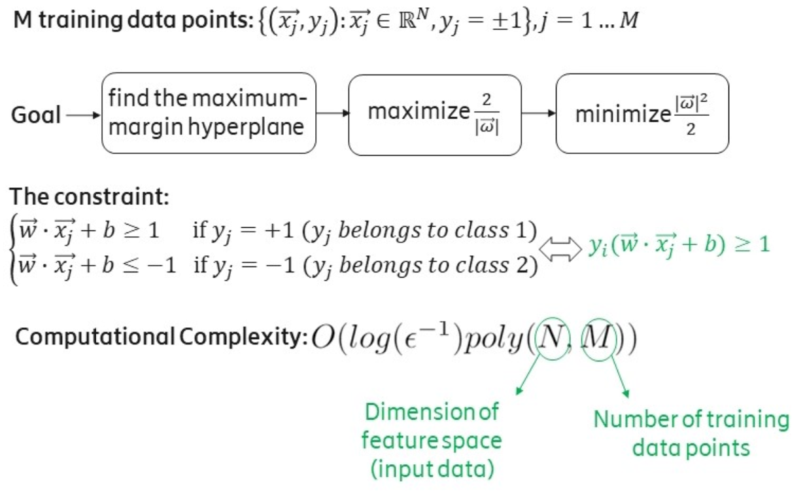

SVM利用了少数的支持向量，通过一个分类超平面将数据分为两类，使这两类之间的间隔最大化，因此它也被称为最大间隔分类器。如图所示，超平面将实心圆和空心圆两类元素进行分类，使两类之间的距离达到最大，处于虚线上的点称为支持向量。

这里重点记录两个变量，**法向量w** 和 **偏移量b**，它们是决定这个超平面的参数。

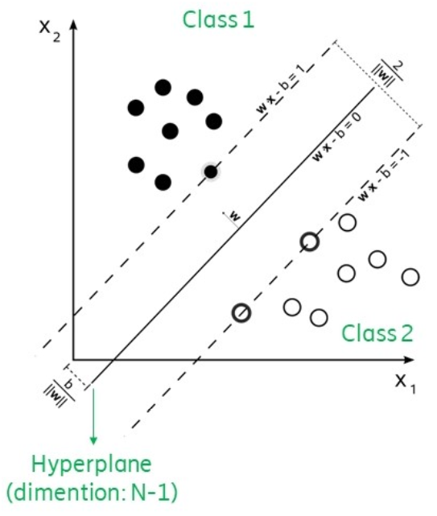

一个支持向量机通过线性可分器实现。目标是寻找到一个超平面能够最好的区分两类数据，并且提供了一个决策边界供后续的分类任务。一个简单的例子是一个一维的线性数据，在点x的两边的数据分别属于类1和类2。在多维的情况下，一个超平面作为边界，在超平面一侧的数据属于一类，在超平面另一侧的数据属于另一类。图中给出的是一个二维的情况。对于线性不可分的情况，可以通过映射实现低维度到高维度的转换，使其变成线性可分。

SVM结构如下所示，其中最关键的两个问题分别是内积的计算和和找到最优的alpha。

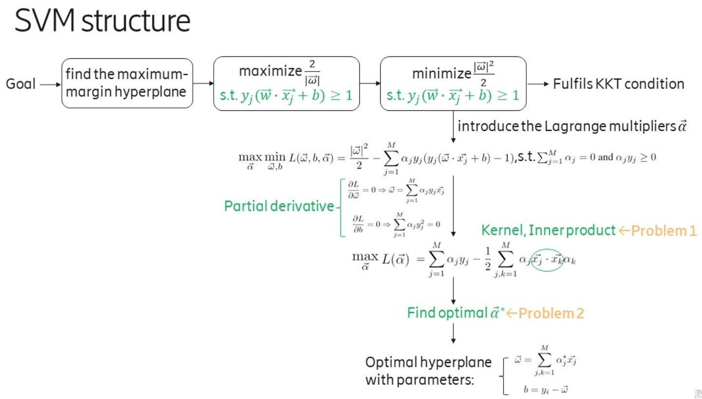

2.QSVM解决的问题
-------------------------

虽然SVM只利用了少量的支持向量，但在计算上还是遍历了所有的样本和所有的特性，因此时间复杂度是**特征数量N**以及**样本数量M**的多项式级。当样本数量很大，比如达到TB(2^40^)和PB(2^50^)级，计算量是相当大的。

在大数据的背景下，量子算法能够提供一个指数级的加速，就像经典中处理1TB的数量，在量子中只要40个量子比特的数量级就可以了。

在2014年MIT和GOOGLE研究所联合发表在PRL的Quantum Support Vector Machine for Big Data Classification这篇文章中，介绍了基于HHL算法的QSVM的实现方法。如下图所示，通过两个量子方法解决了SVM中涉及的两个参数的计算复杂度问题。

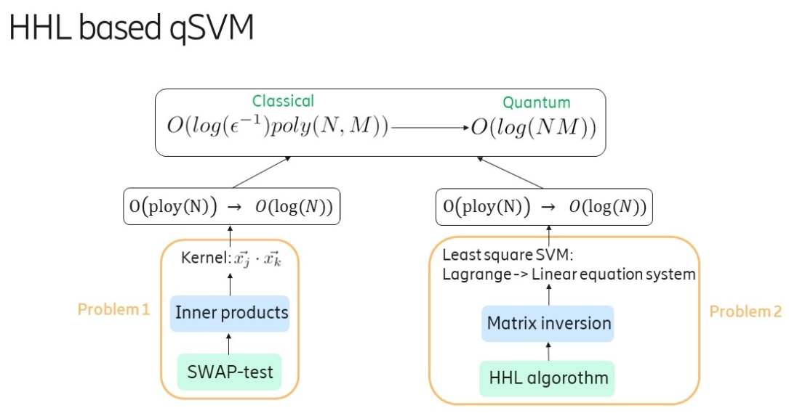

问题1是内积的计算问题，通过SWAP-test实现，问题2是一个基于HHL算法的求解线性方程问题。

3.实现步骤
--------------------

3.1内积的计算
+++++++++++++++++++++

在求解原始的SVM算法时，会将原始问题中对前面提到的参数w和b的求解，通过拉格朗日对偶及KKT条件转换为对拉格朗日乘子alpha的求解，最终通过带入alpha得到原始问题的解w和b。

在求解alpha时，会涉及到核函数，也就是样本之间的内积操作。经典算法复杂度是O(N)，量子的swap test方法可以达到O(logN)

量子线路如下所示

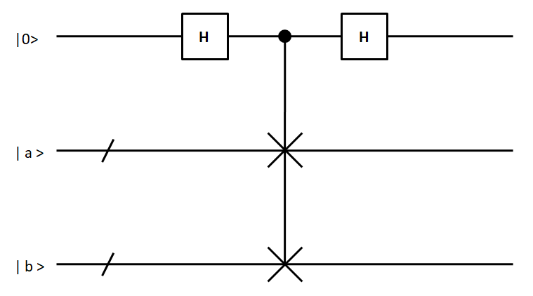

其过程如下：

经过第一个H门后的态：:math:`\left|\psi_{1}\right\rangle=\frac{1}{\sqrt{2}}(|0, a, b\rangle+|1, a, b\rangle)` 

经过受控交换门后的态：:math:`\left|\psi_{2}\right\rangle=\frac{1}{\sqrt{2}}(|0, a, b\rangle+|1, b, a\rangle)` 

经过第二个H门后的态：:math:`\left|\psi_{3}\right\rangle=\frac{1}{2}|0\rangle(|a, b\rangle+|b, a\rangle)+\frac{1}{2}|1\rangle(|a, b\rangle-|b, a\rangle)` 

.. math:: \begin{aligned}P(|0\rangle) &=\left|\left\langle 0 | \psi_{3}\right\rangle\right|^{2} \\&=\left|\frac{1}{2}\langle 0 | 0\rangle(|a, b\rangle+|b, a\rangle)+\frac{1}{2}\langle 0 | 1\rangle(|a, b\rangle-|b, a\rangle)\right|^{2} \\&=\frac{1}{4}|(|a, b\rangle+|b, a\rangle)|^{2} \\&=\frac{1}{4}(\langle b | b\rangle\langle a | a\rangle+\langle b | a\rangle\langle a | b\rangle+\langle a | b\rangle\langle b | a\rangle+\langle a | a\rangle\langle b | b\rangle) \\&=\frac{1}{2}+\frac{1}{2}|\langle a | b\rangle|^{2}\end{aligned}

通过测量的结果，去反求出内积。

根据此线路使用python进行代码实现

::

 import pyqpanda.pyQPanda as pq
 from pyqpanda import *
 import math
 import numpy as np
 
 
 class InitQMachine:
     def __init__(self, quBitCnt, cBitCnt, machineType=pq.QMachineType.CPU):
         self.m_machine = pq.init_quantum_machine(machineType)
         self.m_qlist = self.m_machine.qAlloc_many(quBitCnt)
         self.m_clist = self.m_machine.cAlloc_many(cBitCnt)
         self.m_prog = pq.QProg()
 
     def __del__(self):
         pq.destroy_quantum_machine((self.m_machine))
 
 init_machine = InitQMachine(3, 3)
 qlist = init_machine.m_qlist
 clist = init_machine.m_clist
 machine = init_machine.m_machine
 
 
 # 将输入的特征值进行归一化
 def input_normalize(vector_x):
     x = np.array(vector_x)
     temp = np.sum(np.square(x), axis=1)
     idx = np.argwhere(temp == 0)
     if idx is not None:
         temp[idx] = 0.0000001
     return x/np.sqrt(temp)[:, None]
 
 
 # 构造量子线路SWAP-test
 def construct_qcircuit(q, c, a, b):
     prog = pq.QProg()
     circuit = CreateEmptyCircuit()
     swap_circuit = pq.SWAP(q[1], q[2])
     circuit.insert(pq.H(q[0]))\
         .insert(initial_state(q[1], a))\
         .insert(initial_state(q[2], b))\
         .insert(swap_circuit.control([q[0]]))\
         .insert(pq.H(q[0]))
 
     # prog.insert(circuit).insert(Measure(q[0], c[0]))
     prog.insert(circuit)
 
     # print('draw_qprog:')
     # pq.draw_qprog(prog)
 
     result = prob_run_dict(prog, [q[0]], -1)
     # result = run_with_configuration(prog, c, 10000)
 
     # print(result)
     p0 = result['0']
 
     return p0
 
 
 # 制备量子态，将特征向量通过制备线路变成量子态
 def initial_state(q, x):
     qcir = QCircuit()
     theata = math.acos(x[0]**2-x[1]**2)
     qcir.insert(RY(q, theata))
     # print('draw_qprog:')
     # pq.draw_qprog(qcir)
 
     return qcir
 
 
 # 计算内积
 def cal_inner_product(x):
     # 将x进行归一化
     x = input_normalize(x)
     # print('归一化后的x：', x)
     # 定义列表用于存储测量概率幅的结果
     p0_matrix = []
     for a in x:
         temp = []
         for b in x:
             p0 = construct_qcircuit(qlist, clist, a, b)
             temp.append(p0)
         p0_matrix.append(temp)
     return p0_matrix
 
 
 # 计算核矩阵
 def get_kernel_matrix(x):
     p0 = cal_inner_product(x)
     p0 = np.array(p0)
     # print('测量概率：')
     # print(p0)
     idx = np.argwhere(p0 < 0.5)
     # print(idx)
     if idx.any():
         p0[idx[0], idx[1]] = 0.5 + 0.00000000001
 
     # print('测量概率：')
     # print(p0)
     kernel_matrix = np.round(np.sqrt(p0*2 - 1), 5)
     return kernel_matrix
 
 
 if __name__ == '__main__':
 
     x = [[14, 2], [100, 4], [9, 50], [52, 8], [8, 1], [1, 20]]
     # x = [[4.01, 0.], [0.,   1.4], [1.12, 1.93]]
     k = get_kernel_matrix(x)
 
     k = np.around(k, 4)
     print('核矩阵：')
     print(k)
 
     norm_x = input_normalize(x)
     norm_x = np.around(np.matmul(norm_x, norm_x.T), 4)
     print("计算得到的内积：")
     print(norm_x)
 
     print(k == norm_x)

3.2基于HHL算法的求解b和alpha问题
++++++++++++++++++++++++++++++++++++++

求得内积后就是求解alpha，解alpha是一个二次规划的问题，文章《Quantum support vector machine for big data classification》并没有对原始SVM进行分析，而是对最小二乘支持向量机LSSVM的求解进行了分析。其是基于HHL算法进行实现的。

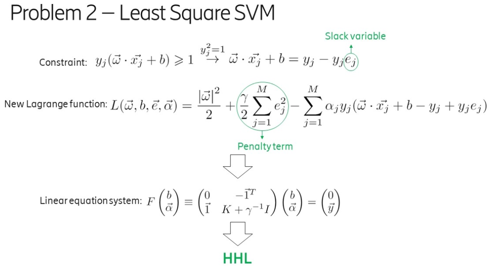

LSSVM通过引入松弛变量e_j，将原来SVM的不等式约束转换为等式约束，大大方便了拉格朗日参数alpha的求解，将原来的QP（Quadratic Programming二次规划）问题转换为求解线性方程组的问题。量子算法在求解线性方程组时能够达到指数级的加速，因此可以用于对LSSVM的求解。

首先是HHL线路图如下所示：

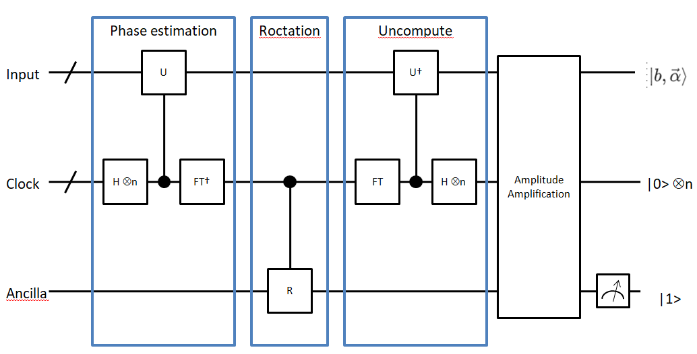

第一步：

输入寄存器的量子态 :math:`|\tilde y\rangle = \sum\limits_{j=1}^{M+1}\langle u_j|\tilde y\rangle|u_j\rangle` ，其中 :math:`|u_j\rangle` 为 :math:`\hat F` 的特征值 :math:`\lambda_j` 对应的特征态，其中 :math:`\hat F = F/trF` 且 :math:`||F||\leq 1` ，:math:`\hat F = (J+K+\gamma^{-1}1)/trF` ，其中 :math:`J=\pmatrix{0 & \vec 1^T \\ \vec 1 & 0}` 。

首先实现任意矩阵的RY旋转角度编码，其代码如下：

::

 """
 目标：实现任意矩阵的量子态振幅编码线路
 """
 import numpy as np
 import math
 
 
 # 对数据进行增补
 def _preprocessing(matrix):
     matrix = np.array(matrix)
     vector = matrix.flat
     length = len(vector)
     n = math.ceil(math.log(length, 2))
     number_zero = 2 ** n - length
     zeros = np.zeros(number_zero)
     # 针对不够2的n次方个数的矩阵，进行补零
     vector = np.append(vector, zeros)
     return vector
 
 
 # 对向量进行分组
 def _queue_vector(vector):
     result = []
     queue = []
     queue.append(vector)
     while queue:
         temp = queue.pop(0)
         result.append(temp)
         left = temp[:len(temp)//2]
         right = temp[len(temp)//2:]
         if len(left) > 1:
             queue.append(left)
         if len(right) > 1:
             queue.append(right)
     return result
 
 
 # vector：预处理后的vector
 def _get_theata(vector_list):
 
     theata_list = []
     temp = []
     i = 0
     for vector in vector_list:
         length = len(vector)
         left = vector[:length//2]
         right = vector[length//2:]
         left_sum = math.fsum(left)
         right_sum = math.fsum(right)
         if left_sum == 0 and right_sum == 0:
             theata = 0
         else:
             theata = 2 * math.acos(left_sum/math.sqrt(left_sum**2 + right_sum**2))
         temp.append(theata)
         if len(temp) == 2**i:
             theata_list.append(temp)
             temp = []
             i += 1
     return theata_list
 
 
 # 对矩阵进行振幅编码，得到结果，形如
 '''
 [
 [2.33], 
 [2.40, 1.57], 
 [2.33, 1.87, 1.76, 1.01], 
 [2.21, 1.85, 1.75, 1.70, 1.67, 1.65, 1.64, 0.0]
 ]
 '''
 def encode_matrix(matrix):
     x = _preprocessing(matrix)
     q = _queue_vector(x)
     # print(q)
     theatas = _get_theata(q)
     return theatas
 
 
 if __name__ == '__main__':
     x = np.arange(1, 16).reshape(3, 5)
     theatas = encode_matrix(x)
     print(theatas)

然后根据得到的RY旋转角度，构建量子线路，其代码如下：

::

 # 振幅编码
 def prepare_state(self, qlist, position, values):
     # 准备RY旋转角度矩阵
     theata_list = encode_matrix(values)
     # 构建线路
     cir = pq.QCircuit()
     control_position = []
     for i, theatas in enumerate(theata_list):
         for j, theata in enumerate(theatas):
             if i == 0:
                 cir.insert(RY(qlist[position+i], theata))
             else:
                 gate = RY(qlist[position + i], theata)
                 # 对当前的索引进行编码
                 temp_cir = self.get_number_circuit(qlist, position, j, i)
                 # 插入索引
                 cir.insert(temp_cir)
                 cir.insert(gate.control(control_position))
                 # 还原
                 cir.insert(temp_cir)
         control_position.append(qlist[position+i])
 
     # print('draw_input_circuit:')
     # pq.draw_qprog(cir)
 
     return cir

第二步：

实现相位估计Phase Estimation

::

 # 相位估计，qlist为量子寄存器，position表示构建线路的位置，number表示相位估计的clock寄存器的数量
 def phase_estimation(self, qlist, position, number):
     cir = QCircuit()
 
     # clock量子比特位置
     clock_position = position + self.number
 
     for i in range(number):
         cir.insert(H(qlist[clock_position + i]))
 
     # 矩阵分解部分的子线路
     for i in range(number):
         # 矩阵酉化, 处理成一个一维的向量，作为matrix_decompose的参数
         matrix = self.unitary(self.norm_F, math.pi/16*2**i)
         # 矩阵分解线路
         temp_cir = self.matrix_decompose(qlist, position, matrix)
         cir.insert(temp_cir.control([qlist[clock_position+i]]))
 
     # 量子傅里叶变换
     for i in range(number):
         cir.insert(H(qlist[clock_position+number-1-i]))
         for j in range(i+1, number):
             cir.insert(CR(qlist[clock_position+number-1-j], qlist[clock_position+number-1-i], 2*math.pi/2**(j-i+1)))
 
     # print('draw_phase_estimation:')
     # pq.draw_qprog(cir)
 
     return cir

【1】模拟 :math:`e^{-i\hat{F}\Delta{t}}` 对于算法第二步的输入，模拟 :math:`e^{-i\hat{F}\Delta{t}}` 的核心是模拟 :math:`K∕trK` 。

其中的难点是构造 :math:`e^{-i\hat{F}\Delta{t}} = e^{-i\Delta{t}1/trF}e^{-iJ\Delta{t}/trF}e^{-iK\Delta{t}/trF} + o(\Delta t^2)` 。

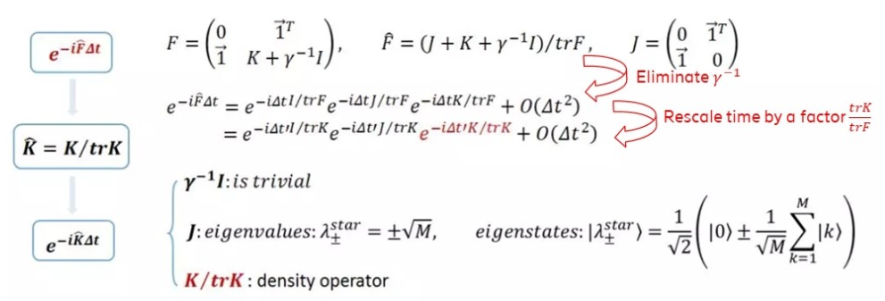

【2】模拟 :math:`\hat K=K/trK` ：这一步核心操作可以通过约化密度算子来实现，也就是通过对密度算子求偏迹运算得到。

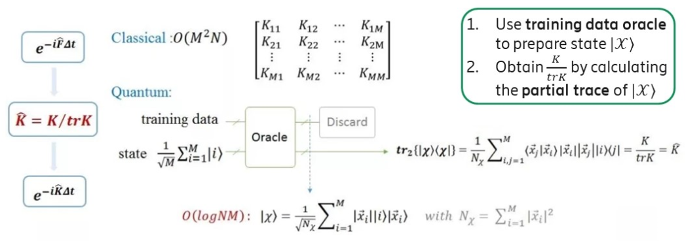

【3】模拟 :math:`e^{-i\hat{K}\Delta{t}}` ：如果K ̂是稀疏的，可以有效的模拟。在 :math:`\hat K` 为非稀疏矩阵时，QPCA《Quatum principal component analysis》这篇论文中提供了一种对非稀疏对称或厄密矩阵的有效模拟方法。

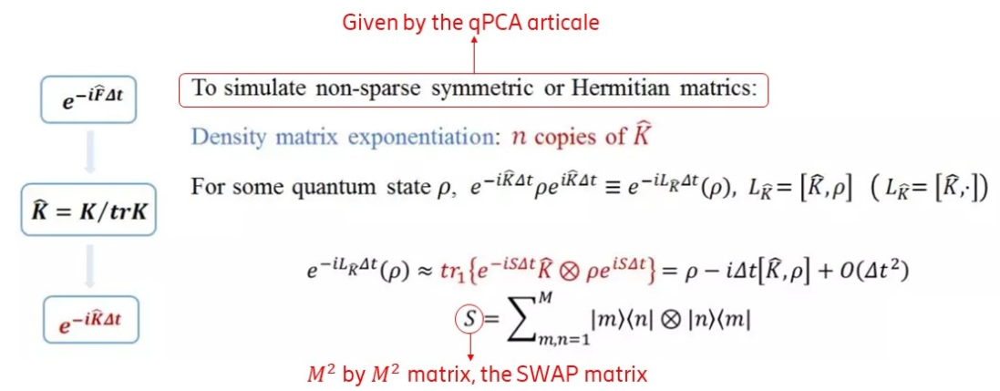

通过以上几步的拆分最终可以实现 :math:`e^{-i\hat{F}\Delta{t}}` 的有效模拟。

其公式他推导过程如下：

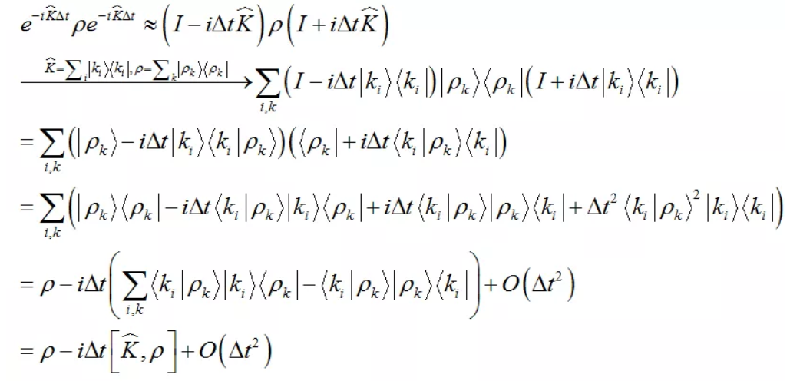

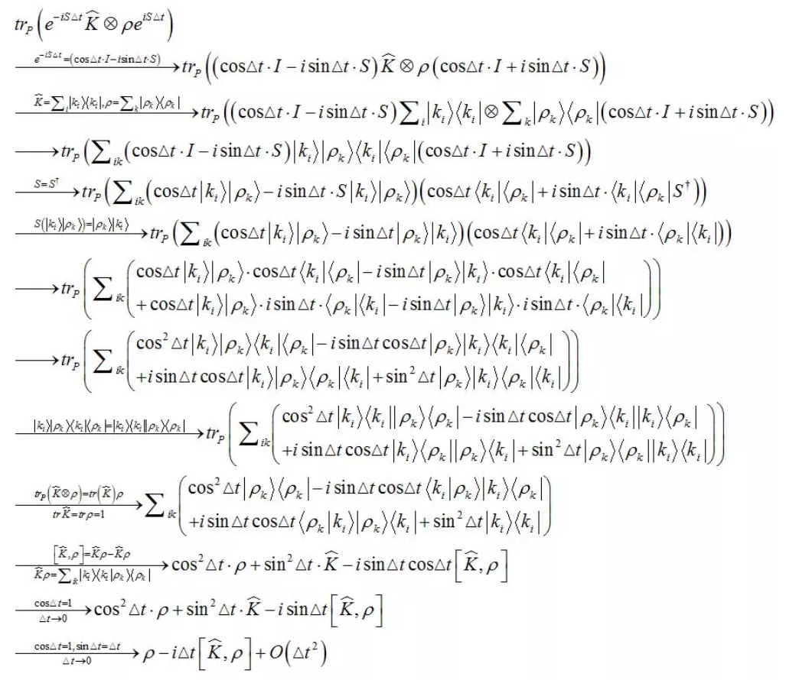

该过程的是一个矩阵分解的操作，其实现过程已经有C++代码实现，调用其接口即可，下面给出python调用该接口实现分解功能的代码。

::

 # 将矩阵进行分解
 def matrix_decompose(self, qlist, position, matrix):
     matrix = matrix.flatten().tolist()
     # print(matrix)
     # 获取分解矩阵的作用比特位置
     qubit_list = []
     for i in range(self.number):
         qubit_list.append(qlist[position + i])
     # 获取分解线路
     cir = pq.matrix_decompose(qubit_list, matrix)
 
     # print('矩阵分解：')
     # pq.draw_qprog(cir)
 
     return cir

第三步：

受控旋转control-rotation

::

 # 受控旋转
 def control_rotate(self, qlist, position, number):
     cir = pq.QCircuit()
     for i in range(number):
         gate = RY(qlist[position+number], math.pi/2**i)
         cir.insert(gate.control([qlist[position + i]]))
 
     # print('draw_control_rotate:')
     # pq.draw_qprog(cir)
 
     return cir

第四步：

振幅放大，通过此将 :math:`|1\rangle` 态的幅值放大，提高测量的成功率，目前该步暂时不用，直接去进行测量得到结果。

第五步：

测量最后一个量子位，如果结果是 :math:`|1\rangle` ，则输入比特的输出就是需要的结果 :math:`|b,\vec\alpha\rangle = \frac{1}{\sqrt C}(b|0\rangle + \sum\limits_{k=1}^M\alpha_k|k\rangle)` 

综合以上所有过程，整体代码如下：

::

 """
 HHL算法
 """
 from pyqpanda import *
 import pyqpanda.pyQPanda as pq
 import numpy as np
 import math
 from scipy.linalg import expm
 from swap_test import get_kernel_matrix
 from encode_on_matrix import encode_matrix
 
 
 class InitQMachine:
     def __init__(self, quBitCnt, cBitCnt, machineType=pq.QMachineType.CPU):
         self.m_machine = pq.init_quantum_machine(machineType)
         self.m_machine.set_configure(35, 35)
         self.m_qlist = self.m_machine.qAlloc_many(quBitCnt)
         self.m_clist = self.m_machine.cAlloc_many(cBitCnt)
         self.m_prog = pq.QProg()
 
     def __del__(self):
         pq.destroy_quantum_machine((self.m_machine))
 
 
 class HHL:
     def __init__(self, x, y):
         self.x = x
         self.y = y
         # 核矩阵
         self.k = self.get_kernel(x)
         # 数据的数量
         self.m = len(self.x)
         # 输入线路数据的数量
         self.M = self.m + 1
         # F矩阵
         self.F = self.get_F_matrix(self.k)
         # 归一化后的 F矩阵
         self.norm_F = self.normalize_matrix(self.F)
         # 归一化F矩阵的特征值，和特征向量
         self.eigenvalue, self.eigenvector = self.eigenvalues_of_matrix(self.norm_F)
         # HHL输入量子比特数
         self.number = math.ceil(math.log(self.M, 2))
         # HHL输入参数值
         self.input_y = np.insert(self.y, 0, values=0)
 
     # 获取核矩阵
     def get_kernel(self, x):
         k = get_kernel_matrix(x)
         return k
 
     # 获取F矩阵
     def get_F_matrix(self, k):
         ones_col = np.ones(k.shape[0])
         first_line = np.ones(k.shape[1] + 1)
         first_line[0] = 0
         F = np.column_stack((ones_col, k))
         F = np.row_stack((first_line, F))
         return F
 
     # 矩阵的特征值,和特征向量
     def eigenvalues_of_matrix(self, matrix):
         eigenvalues, eigenvector = np.linalg.eig(matrix)
         return eigenvalues, eigenvector
 
     # 矩阵的迹
     def trace_of_matrix(self, matrix):
         matrix = np.array(matrix)
         shape = matrix.shape
         if shape[0] != shape[1]:
             raise("matrix must be a square matrix")
         return np.sum(matrix.diagonal())
 
     # 矩阵的归一化
     def normalize_matrix(self, matrix):
         matrix = np.array(matrix)
         trace = self.trace_of_matrix(matrix)
         return matrix/trace
 
     # 计算matrix转置共轭矩阵
     def transposed_conjugate(self, target_matrix):
         return np.conjugate(target_matrix.T)
 
     # 定义判断矩阵是否是酉矩阵
     def is_unitary(self, target_matrix):
         trans_conj_of_matrix = self.transposed_conjugate(target_matrix)
         product = np.around(np.dot(target_matrix, trans_conj_of_matrix), 5)
         ones_matrix = np.identity(product.shape[0])
         result = (product == ones_matrix).all()
         return result
 
     # 将matrix进行酉化
     def unitary(self, matrix, t0):
         matrix = np.array(matrix)
         # print(matrix)
         if self.is_unitary(matrix):
             return matrix
         return expm(-1j * matrix * t0)
 
     # 根据当前number绘制子线路
     def get_number_circuit(self, qlist, position, number, qubit_number):
         cir = pq.QCircuit()
         # 把当前item的数字变成二进制数字符串，并去除前面的0b字符
         bin_str = bin(number).replace('0b', '')
         # 对于不足量子比特数的前面用0进行补齐，并逆排序
         bin_str = list((qubit_number - len(bin_str)) * '0' + bin_str)
         for j, bit in enumerate(bin_str):
             if bit == '0':
                 cir.insert(X(qlist[position + j]))
 
         # print('画子线路')
         # pq.draw_qprog(cir)
 
         return cir
 
     # 振幅编码
     def prepare_state(self, qlist, position, values):
         # 准备RY旋转角度矩阵
         theata_list = encode_matrix(values)
         # 构建线路
         cir = pq.QCircuit()
         control_position = []
         for i, theatas in enumerate(theata_list):
             for j, theata in enumerate(theatas):
                 if i == 0:
                     cir.insert(RY(qlist[position+i], theata))
                 else:
                     gate = RY(qlist[position + i], theata)
                     # 对当前的索引进行编码
                     temp_cir = self.get_number_circuit(qlist, position, j, i)
                     # 插入索引
                     cir.insert(temp_cir)
                     cir.insert(gate.control(control_position))
                     # 还原
                     cir.insert(temp_cir)
             control_position.append(qlist[position+i])
 
         # print('draw_input_circuit:')
         # pq.draw_qprog(cir)
 
         return cir
 
     # 将矩阵进行分解
     def matrix_decompose(self, qlist, position, matrix):
         matrix = matrix.flatten().tolist()
         # print(matrix)
         # 获取分解矩阵的作用比特位置
         qubit_list = []
         for i in range(self.number):
             qubit_list.append(qlist[position + i])
         # 获取分解线路
         cir = pq.matrix_decompose(qubit_list, matrix)
 
         # print('矩阵分解：')
         # pq.draw_qprog(cir)
 
         return cir
 
     # 相位估计，qlist为量子寄存器，position表示构建线路的位置，number表示相位估计的clock寄存器的数量
     def phase_estimation(self, qlist, position, number):
         cir = QCircuit()
 
         # clock量子比特位置
         clock_position = position + self.number
 
         for i in range(number):
             cir.insert(H(qlist[clock_position + i]))
 
         # 矩阵分解部分的子线路
         for i in range(number):
             # 矩阵酉化, 处理成一个一维的向量，作为matrix_decompose的参数
             matrix = self.unitary(self.norm_F, math.pi/16*2**i)
             # 矩阵分解线路
             temp_cir = self.matrix_decompose(qlist, position, matrix)
             cir.insert(temp_cir.control([qlist[clock_position+i]]))
 
         # 量子傅里叶变换
         for i in range(number):
             cir.insert(H(qlist[clock_position+number-1-i]))
             for j in range(i+1, number):
                 cir.insert(CR(qlist[clock_position+number-1-j], qlist[clock_position+number-1-i], 2*math.pi/2**(j-i+1)))
 
         # print('draw_phase_estimation:')
         # pq.draw_qprog(cir)
 
         return cir
 
     # 受控旋转
     def control_rotate(self, qlist, position, number):
         cir = pq.QCircuit()
         for i in range(number):
             gate = RY(qlist[position+number], math.pi/2**i)
             cir.insert(gate.control([qlist[position + i]]))
 
         # print('draw_control_rotate:')
         # pq.draw_qprog(cir)
 
         return cir
 
     # 构建 HHL 线路
     def hhl_circuit(self, qlist, position, clock_number):
         cir = pq.QCircuit()
 
         pe_position = position
         cr_position = position + self.number
         # 相位估计线路
         phase_estimation_cir = self.phase_estimation(qlist, pe_position, clock_number)
         # 受控旋转线路
         control_rotate_cir = self.control_rotate(qlist, cr_position, clock_number)
 
         cir.insert(phase_estimation_cir) \
             .insert(control_rotate_cir) \
             .insert(phase_estimation_cir.dagger())
 
         # print('draw_qprog:')
         # pq.draw_qprog(cir)
 
         return cir
 
     # 带输入量子编码的 HHL线路, 并进行求解 |b, a>
     def solve_hhl_cir(self, qlist, position, clock_number, input_values):
         # 输入编码线路
         input_cir = self.prepare_state(qlist, position, input_values)
         # HHL线路
         hhl_cir = self.hhl_circuit(qlist, position, clock_number)
         prog = pq.QProg()
         prog.insert(input_cir)
         prog.insert(hhl_cir)
 
         # print('draw_qprog:')
         # pq.draw_qprog(prog)
 
         directly_run(prog)
         full_state = get_qstate()
         return full_state
 
     # 筛选出辅助比特测量结果是 1的态
     def postselect(self, statevector, qubit_index, value):
         mask = 1 << qubit_index
         # print('mask:')
         # print(mask)
         # print('statevector:')
         # print(statevector)
         if value:
             array_mask = np.arange(len(statevector)) & mask
         else:
             array_mask = not (np.arange(len(statevector)) & mask)
 
         # print('array_mask:')
         # print(array_mask)
 
         def normalise(vec: np.ndarray):
             from scipy.linalg import norm
             return vec / norm(vec)
 
         return normalise(statevector[array_mask != 0])
 
     # 近似运算
     def round_to_zero(self, vec, tol=2e-15):
         vec.real[abs(vec.real) < tol] = 0.0
         vec.imag[abs(vec.imag) < tol] = 0.0
         return vec
 
     # 计算结果
     def get_result(self, qlist):
         full_state = np.array(self.solve_hhl_cir(qlist, 0, self.M, self.input_y))
         statevector = self.round_to_zero(self.postselect(full_state, 6, True), 1e-3)
         solution = statevector[:self.M]
         return solution.real
 
     def run(self):
 
         init_machine = InitQMachine(7, 7)
         qlist = init_machine.m_qlist
         clist = init_machine.m_clist
         machine = init_machine.m_machine
 
         print('HHL输入的向量：')
         print(self.input_y)
         print('核矩阵：')
         print(self.k)
         print('F矩阵：')
         print(self.F)
         print('归一化后的F矩阵：')
         print(self.norm_F)
         print('特征值：')
         print(self.eigenvalue)
         print('特征向量：')
         print(self.eigenvector)
         print('数据的数量：')
         print(self.M)
 
         # 根据数字进行二进制编码，绘制线路
         # self.get_number_circuit(qlist, 0, 0, 2)
 
         # 振幅编码
         # l = [i for i in range(15)]
         # self.prepare_state(qlist, 0, l)
 
         # 矩阵酉化
         # matrix = self.unitary(self.norm_F, math.pi/8)
         # print('酉化后的矩阵：')
         # print(matrix)
 
         # 矩阵分解
         # self.matrix_decompose(qlist, 0, matrix)
 
         # 相位估计线路
         # self.phase_estimation(qlist, 1, self.M)
 
         # 受控旋转
         # self.control_rotate(qlist, self.number, self.M)
 
         # hhl线路
         # self.hhl_circuit(qlist, 0, self.M)
 
         # # 带输入的 HHL求解线路
         # self.solve_hhl_cir(qlist, 0, self.M, self.input_y)
 
         # 处理结果
         print('结果：')
         print(self.get_result(qlist))
 
 
 def solve(x, y):
     init_machine = InitQMachine(7, 7)
     qlist = init_machine.m_qlist
     hhl = HHL(x, y)
     result = hhl.get_result(qlist)
     return result
 
 
 if __name__ == '__main__':
     # 数据的准备
     x = []
     y = []
     with open('./data3.txt', 'r') as f:
         for line in f.readlines():
             if line:
                 data_list = line.strip().split(' ')
                 x.append([float(data_list[0]), float(data_list[1])])
                 y.append(float(data_list[2]))
     # 数据的整理
     x = np.array(x)
     y = np.array(y)
     x = np.around(x, 2)
     min_val = np.min(x, axis=0)
     x[:, 0] = x[:, 0] - min_val[0]
     x[:, 1] = x[:, 1] - min_val[1]
 
     # hhl = HHL(x, y)
     # hhl.run()
 
     result = solve(x, y)
     print(result)

经过以上五步即可实现HHL求解线性方程得到输出的量子态 :math:`|b, \vec\alpha\rangle` ，通过将量子态送入到分类线路即可进行分类。下面分析分类的过程。

3.3分类
++++++++++++++

以上是训练的去得到量子态 :math:`|b, \vec\alpha\rangle` 的过程，接下来是分类，整个分类的线路图如下所示：

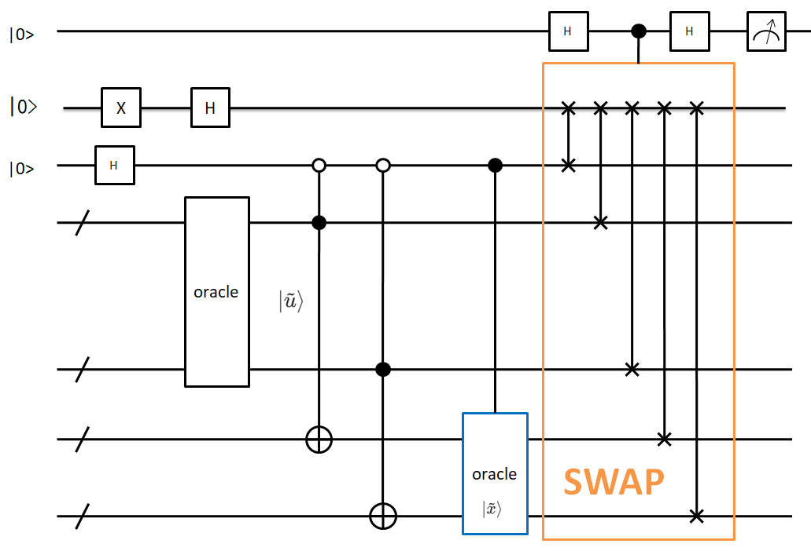

** 第一步、构造training data oracle **

对于一个给定的新数据 :math:`|\vec x\rangle` 进行分类，通过构造一个training data oracle实现下面的计算

.. math:: |\tilde u\rangle = \frac{1}{\sqrt N_\tilde u}(b|0\rangle|0\rangle + \sum\limits_{k=1}^M\alpha_k|\vec x_k||k\rangle|\vec x_k\rangle)

其中 :math:`N_\tilde u=b^2+\sum\limits_{k=1}^M\alpha_k^2|\vec x_k|^2` 。系数为 :math:`\{b,\alpha_1|\vec {x_1}|,\alpha_2|\vec {x_2}|,...,\alpha_M|\vec {x_M}|\}` 

另外，构造如下态：

.. math:: |\tilde x\rangle = \frac{1}{\sqrt N_\tilde x}(|0\rangle|0\rangle + \sum\limits_{k=1}^M|\vec x||k\rangle|\vec x\rangle)

其中 :math:`N_\tilde x=M|\vec x|^2+1` 。系数为 :math:`\{1,|\vec {x_1}|,|\vec {x_2}|,...,|\vec {x_M}|\}` ，其中 :math:`\vec {x_i} = \vec x` 

此处的量子线路构建如下图所示

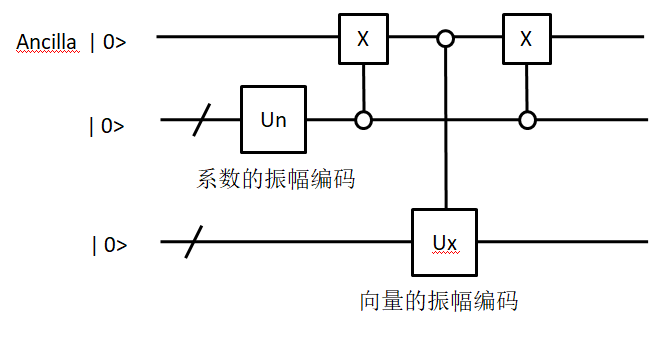

对输入的系数和向量进行振幅编码

代码如下：

::

 # 振幅编码
 def prepare_state(self, qlist, position, values):
     # 准备RY旋转角度矩阵
     theata_list = encode_matrix(values)
     # 构建线路
     cir = pq.QCircuit()
     control_position = []
     for i, theatas in enumerate(theata_list):
         for j, theata in enumerate(theatas):
             if i == 0:
                 cir.insert(RY(qlist[position+i], theata))
             else:
                 gate = RY(qlist[position + i], theata)
                 # 对当前的索引进行编码
                 temp_cir = self.get_number_circuit(qlist, position, j, i)
                 # 插入索引
                 cir.insert(temp_cir)
                 cir.insert(gate.control(control_position))
                 # 还原
                 cir.insert(temp_cir)
         control_position.append(qlist[position+i])
 
     # print('draw_input_circuit:')
     # pq.draw_qprog(cir)
 
     return cir

编码后，通过如下线路实现 :math:`|\psi\rangle` 

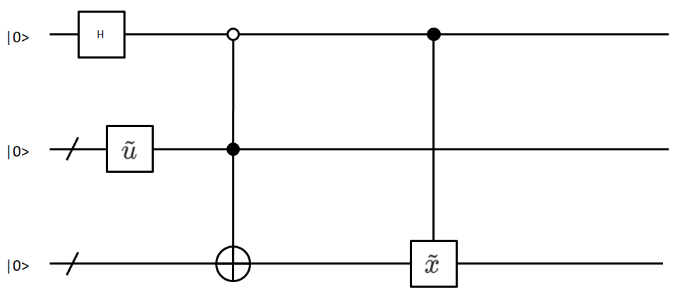

.. math:: |\psi\rangle=\frac{1}{\sqrt2}(|0\rangle|\tilde u\rangle+|1\rangle|\tilde x\rangle) 。

代码如下：

::

 # 构建线路实现  ψ = 1/sqrt(2)(|0>|u> + |1>|x>)
 def construct_state_psi(self, qlist, position, u_coefficient, u_vector, x_coefficient, x_vector, oracle_qubits):
 
     # u线路
     u_cir_position = position + 1
     u_cir = self.training_data_oracle(qlist, u_cir_position, u_coefficient, u_vector)
     # x线路
     x_cir_position = position + 1 + oracle_qubits
     x_cir = self.training_data_oracle(qlist, x_cir_position, x_coefficient, x_vector)
     # 受控CNOT门
     cir_copy = pq.QCircuit()
     for i in range(oracle_qubits):
         cir_copy.insert(CNOT(qlist[u_cir_position+i], qlist[x_cir_position+i]))
     # 插入受控 CNOT门
 
     cir = pq.QCircuit()
     # 在辅助比特上插入H门,X门
     cir.insert(H(qlist[position]))
     cir.insert(X(qlist[position]))
     # 插入u线路
     cir.insert(u_cir)
     # 插入受控CNOT门
     cir.insert(cir_copy.control([qlist[position]]))
     # 控制下路x门还原
     cir.insert(X(qlist[position]))
     # 插入x线路
     cir.insert(x_cir)
 
     # print('Psi线路:')
     # pq.draw_qprog(cir)
 
     return cir

通过如下线路构建 :math:`|\phi\rangle=\frac{1}{\sqrt2}(|0\rangle-|1\rangle)` 。

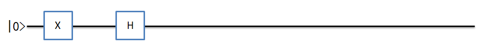

代码如下：

::

 # 构建线路实现  φ = 1/sqrt(2)(|0> - |1>)
 def construct_state_phi(self, qlist, position):
     cir = pq.QCircuit()
     cir.insert(X(qlist[position]))
     cir.insert(H(qlist[position]))
 
     # print('Phi线路:')
     # pq.draw_qprog(cir)
 
     return cir

** 第二步、swap test实现 **

目标概率 :math:`P=|\langle\psi|\phi\rangle|^2=\frac{1}{2}(1-\langle\tilde u|\tilde x\rangle)` 。

通过测量辅助比特0的概率 :math:`P(|0\rangle)=\frac{1}{2}+\frac{1}{2}|\langle \psi | \phi\rangle|^{2}` 进行计算得到目标概率P

线路与内积计算线路相同，只是根据线路的数量不同进行一个扩展，代码如下：

::

 # 通过测量辅助比特0态的概率去反推|<ψ|φ>|^2的概率,即 P(|0>) = 1/2 + 1/2(|<ψ|φ>|^2)
 def swap_test_p(self, qlist, position, swap_qubits):
     cir = pq.QCircuit()
     cir.insert(H(qlist[position]))
     phi_position = position+1
     psi_position = phi_position+1
     # 交换线路
     swap_cir = pq.QCircuit()
     for i in range(swap_qubits):
         swap_cir.insert(SWAP(qlist[phi_position], qlist[psi_position+i]))
     # 交换线路受控于辅助比特
     cir.insert(swap_cir.control([qlist[position]]))
     cir.insert(H(qlist[position]))
 
     # print('SWAP-TEST线路:')
     # pq.draw_qprog(cir)
 
     return cir

** 第三部、分类 **

通过比较P与0.5的大小来划分输入数据的类别，小于0.5属于-1类，大于0.5属于+1类。

4.总结
+++++++++++++

以上是QSVM的所有过程。

通过HHL求解出线性方程的系数，然后将系数带入分类线路进行分类。经过以上过程即可实现一个简单的二分类任务。

